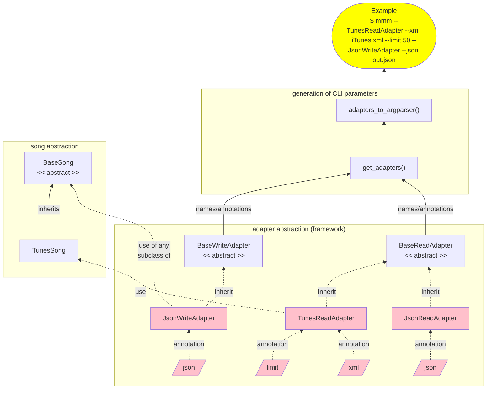
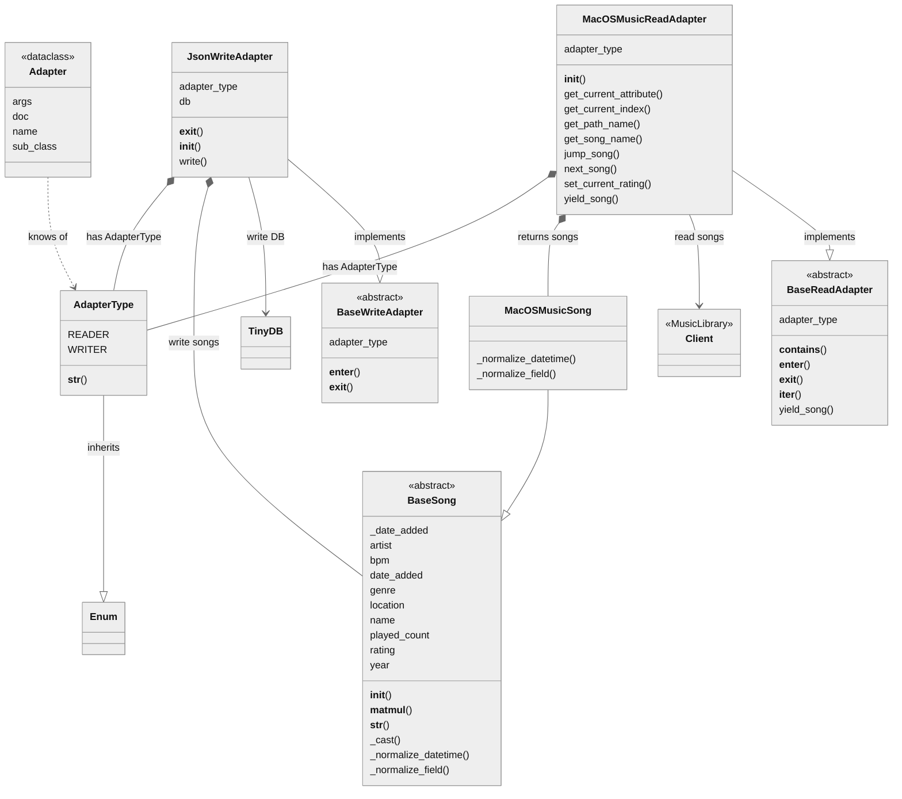

# Music Meta Manager

[](https://www.python.org/downloads/release/python-311/)

## Background

It started with a need for a library/application allowing me to transfer meta-data from Apple's iTunes *(such a ⭐️ rating)* that I had backup of into the more recent  MacOS Music application. I would also like to be able to export this meta-data into a more future-proof format as JSON in case of use with a different application. Another sample use-case to use this for filtering out songs to your need, read the song file path and copy it to a device such as an MP3 player.

The field names might differ between those applications and different packages exists to support <u>reading and writing interchangeably</u> between those so to allow this and at the same time make this <u>extensible</u> I found a good opportunity to write this as a <u>package</u> to fill this gap.

A good opportunity to challenge me to think more about the software design to follow principles such as [SOLID](https://en.wikipedia.org/wiki/SOLID) to make the code easier to read and maintain. 

This package is designed to make it easy for developers to extend with additional formats thanks to [abstract base classes](https://wiki.python.org/moin/AbstractBaseClasses) documented further down. And also use some ✨magic✨ to allow command line help and arguments to reflect automatically based on your formats defined to easier follow [DRY](https://en.wikipedia.org/wiki/Don%27t_repeat_yourself) principles more. And using some interesting aspects such as [operator overloading](https://en.wikipedia.org/wiki/Operator_overloading) that allows easier sorting and comparison operations have been used. 

## Use cases

- Dump all music "meta" data from specific sources for backup purposes
- Update another target with such data that could easily be manipulated using e.g. JSON
- Develop custom Python code for e.g. *"get me file paths of songs more recent than 2 years and has more than 3 stars as rating"*
- Compare and analyse songs from different sources

## Requirements

- Python 3.11
- macOS (if you wish to use the macOS Music component)

## Installation

For installing this as a command line application you easiest follow the below steps

```bash
$ python -m pip install pipx
$ pipx install git+https://github.com/engdan77/music_meta_manager.git
```

## Command line interface

The below is to show how the parameters and help section would automatically get generated based on the above sample.
To simplify not show all the built-in adapters.

#### Migrating music metadata between services and formats

```shell
$ music_migrate --help

usage: music_migrate [-h] [--TunesReadAdapter] [--xml XML] [--limit LIMIT] [--MacOSMusicReadAdapter] [--JsonReadAdapter] [--json_read JSON_READ] [--JsonWriteAdapter] [--json_write JSON_WRITE]
                    [--MacOSMusicWriteAdapter] [--match_fields MATCH_FIELDS] [--exclude_fields EXCLUDE_FIELDS]

options:
  -h, --help            show this help message and exit

TunesReadAdapter:
  --TunesReadAdapter    Read from iTunes Reads from XML
  --xml XML             [TunesReadAdapter] xml file from iTunes (default: /Users/edo/Music/backup/iTunes Library.xml)
  --limit LIMIT         [TunesReadAdapter] limit to number of songs (default: 0)

MacOSMusicReadAdapter:
  --MacOSMusicReadAdapter
                        Read from macOS Music application This connects to macOS application running

JsonReadAdapter:
  --JsonReadAdapter     Read from JSON
  --json_read JSON_READ
                        [JsonReadAdapter] json file (default: /tmp/music.json)

JsonWriteAdapter:
  --JsonWriteAdapter    Write to JSON
  --json_write JSON_WRITE
                        [JsonWriteAdapter] json file (default: /tmp/music.json)

MacOSMusicWriteAdapter:
  --MacOSMusicWriteAdapter
                        Write song to macOS Music application This connects to macOS application running
  --match_fields MATCH_FIELDS
                        [MacOSMusicWriteAdapter] match fields before updates, comma separated (default: name,artist)
  --exclude_fields EXCLUDE_FIELDS
                        [MacOSMusicWriteAdapter] which fields to exclude, comma separated (default: none)
```

#### Fixing path location

This uses the same arguments as migrating with the difference that it will bring up a "folder browser" that allows you to specify which folder you should allow the application to search for the "correct" file path to update the "location" field for each MP3.

```bash
$ music_fix_location --help
```


## Current built-in support for applications/formats

### Read

- TunesReadAdapter
- MacOSMusicReadAdapter
- JsonReadAdapater

### Write

- JsonWriteAdapter

## Sample use cases

### Reading data from iTunes and writing to JSON file

```python
with TunesReadAdapter(limit=3) as r, JsonWriteAdapter('my_music.json') as w:
  for song in r:
    print(f"Writing: {song}")
    w.write(song)
```

#### Resulting in

```
Writing: 10,000 Maniacs - Because The Night                        1998   ⭐️⭐️⭐️⭐️
Writing: Phil Fuldner - S-Express                                  1999   ⭐️⭐️
Writing: Hampenberg - Last Night                                   1999   ⭐️⭐️
```

### Usage of comparison operators on songs

```python
>>> print(song)
10,000 Maniacs - Because The Night                        1998   ⭐️⭐️⭐️⭐️

>>> song >= '⭐⭐'
True

>>> song < 1996
False

>>> other_song = song
>>> song @ other_song  # a special operator for comparing that name and album match
True
```

### Easily filtering with help of comparison

```python
>>> [song.name for song in TunesReadAdapter() if song >= '⭐⭐⭐' and song < 2022]
['Because The Night']
```


## Software design

Following a form of [bridge-pattern](https://en.wikipedia.org/wiki/Bridge_pattern) that allows us to abstract the application *(adapter)* class the field-definition *(song)*  to easier add support for additional applications and song structures. Built into this package also supports being used as a <u>command-line tool</u> for easily transferring songs across applications or files.

Thanks to using *abstract base classes*, *type annotations* and *docstrings* allow the <u>automatic generation of the parameters</u> thanks to some of the clever mechanics within Python.

Also adding some basic [operator overloading](https://en.wikipedia.org/wiki/Operator_overloading) for comparison and filtering purposes of songs.

Below is how I would visualize the software design and further down in this documentation you will also find a more complete class-diagram.




## Tutorial - User Guide for developers

Below we'll take you through a sample where would add an additional CSV writer and reader for song metadata e.g. to be transferred to the MacOS Music application.

### Create a custom Song class

This is to be used together with your ReadAdapter or WriteAdapter by inheriting BaseSong and implementing the abstract methods with its main responsibility

- Normalize the field name in that application interchangeable with BaseSong
- Convert string representation of datetime used for e.g. "created"

```python
class CsvSong(BaseSong):
    @staticmethod
    def normalize_field(foreign_field_name: Annotated[str, "Field name to be converted"]) -> Annotated[str, "Dataclass field name"]:
        """
        Required concrete method responsible for resolving field/attributes and inherits from BaseSong as dataclass.
        The below sample assures that field named "Path" will be read as "Location" when read.
        """
        t = {"Path": "Location"}
        return t.get(foreign_field_name, foreign_field_name)

    @staticmethod
    def normalize_datetime(foreign_datetime: Annotated[str, "Datetime text to be converted"]) -> datetime.datetime:
        """
        Required concrete method responsible parsing the date_added into a valid datetime object.
        The below sample will use datetime.strptime to parse according to "format".
        """
        return datetime.datetime.strptime(foreign_datetime, "%Y-%m-%dT%H:%M:%SZ")

```


### Create a custom WriteAdapter class

This gives a different example creating an adapter that allows writing to a CSV file. Main responsibility of those concrete methods are .. 

- initialize the writing of the data
- closing any resources exiting a context manager
- write operation using a instantiation of above song class

```python
class CsvWriteAdapter(BaseWriteAdapter):
    """Write to a CSV"""

    def __init__(self, write_csv: Annotated[str, "path to csv file"]) -> None:
        """
        Create a constructor for this adapter
        """
        self.csv_file = open(csv, 'w')

    def __exit__(self, exc_type, exc_val, exc_tb):
        """
        This is used for Context Manager assuring closing any resources
        """
        self.csv_file.close()

    def write(self, song: BaseSong):
        """
        Require abstract method to allow the WriteAdapter to function.
        Takes a BaseSong as argument and should write to the resource.
        """
        song_data = [song.name, song.artist, song.location]
        self.write(f"{'\t'.join(song_data)}\n")
```


### Create a custom ReadAdapter class

This is just to illustrate a sample reading from a CSV file. The docstring and annotation being used to generate help for CLI parameters and the main responsibility of the concrete methods are ..

- initalize the application for reading
- yield song used to allow the reader to act as an iterable

```python
class CsvReadAdapter(BaseReadAdapter):
    """Read from CSV"""

    def __init__(self, read_csv: Annotated[str, "path to csv file"]):
        """
        Type annotation will automatically generate CLI parameter type and description.
        """
        self.local_fields = ["Name", "Artist", "Path"]
        self.csv_file = csv_file

    def yield_song(self) -> Iterable[BaseSong]:
        """
        Required concrete method that "has a" (composition) and returns an Iterable of BaseSongs. 
        """
        with open(self.csv_file, 'r') as f:
            for line in csv.reader(f, delimiter='\t'):
                next_song = dict(zip(self.local_field, line))
                yield(CsvSong(**next_song))
```


## Design documentation

### Class diagram

This below class diagram intentionally does not include all built-in classes to allow easier reading.



## Credit to other packages

- [appdirs](https://github.com/ActiveState/appdirs)
- [iReadiTunes](https://github.com/mickael2054/IReadiTunes)
- [pytunes](https://github.com/hile/pytunes/)
- [tinydb](https://pypi.org/project/tinydb/) and [tinydb-serialization](https://pypi.org/project/tinydb-serialization/)
- [music-tag](https://github.com/KristoforMaynard/music-tag)
- [loguru](https://github.com/Delgan/loguru)

