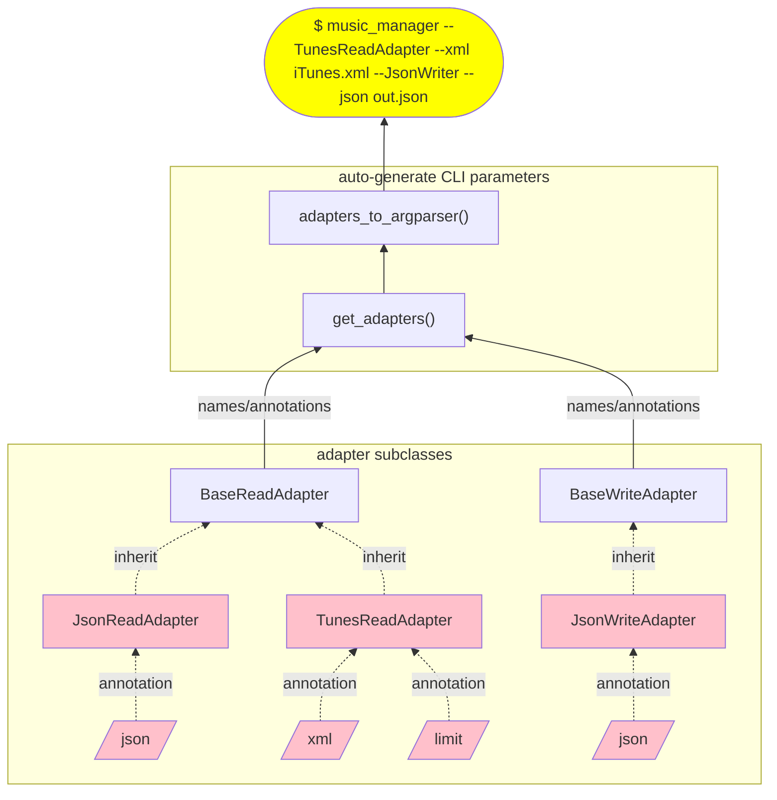
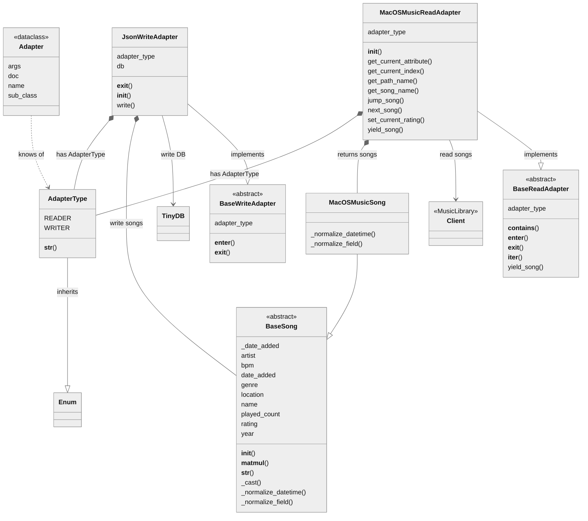

# Music Manager

Description goes here...

## Current built-in adapters

### Read
- TunesReadAdapter
- MacOSMusicReadAdapter

### Write
- JsonWriteAdapter

## Quick into how to extend additional adapters

### Sample for creating a custom Song class

This is to be used together with your ReadAdapter or WriteAdapter by inherit BaseSong and implements the abstract methods.

```python
class CsvSong(BaseSong):
    @staticmethod
    def _normalize_field(foreign_field_name: Annotated[str, "Field name to be converted"]) -> Annotated[str, "Dataclass field name"]:
        """
        Required concrete method responsible for resolving field/attributes and inherits from BaseSong as dataclass.
        The below sample assures that field named "Path" will be read as "Location" when read.
        """
        t = {"Path": "Location"}
        return t.get(foreign_field_name, foreign_field_name)

    @staticmethod
    def _normalize_datetime(foreign_datetime: Annotated[str, "Datetime text to be converted"]) -> datetime.datetime:
        """
        Required concrete method responsible parsing the date_added into a valid datetime object.
        The below sample will use datetime.strptime to parse according to "format".
        """
        return datetime.datetime.strptime(foreign_datetime, "%Y-%m-%dT%H:%M:%SZ")

```

### Sample for creating a new ReadAdapter

This is just to illustrate a sample using the above CsvSong.
The docstring and annotation being used to generate help for CLI parameters.

```python
class CsvReadAdapter(BaseReadAdapter):
    """Read from CSV"""

    def __init__(self, csv_file: Annotated[str, "path to csv file"]):
        """
        Type annotation will automatically generate CLI parameter type and description.
        """
        self.local_fields = ["Name", "Artist", "Path"]
        self.csv_file = csv_file

    def yield_song(self) -> Iterable[BaseSong]:
        """
        Required concrete method that "has a" (composition) and returns an Iterable of BaseSongs. 
        """
        with open(self.csv_file, 'r') as f:
            for line in csv.reader(f, delimiter='\t'):
                next_song = dict(zip(self.local_field, line))
                yield(CsvSong(**next_song))
```

### Sample for creating a new WriteAdapter

```python
class CsvWriteAdapter(BaseWriteAdapter):
    """Write to CSV"""

    def __init__(self, csv: Annotated[str, "path to csv file"]) -> None:
        """
        Create a constructor for this adapter
        """
        self.csv_file = open(csv, 'w')

    def __exit__(self, exc_type, exc_val, exc_tb):
        """
        This is used for Context Manager assuring closing any resources
        """
        self.csv_file.close()

    def write(self, song: BaseSong):
        """
        Require abstract method to allow the WriteAdapter to function.
        Takes a BaseSong as argument and should write to the resource.
        """
        song_data = [song.name, song.artist, song.location]
        self.write(f"{'\t'.join(song_data)}\n")
```

### Test the command line

```shell
$ musicmanager --help

usage: musicmanager [-h] ... [--CsvReadAdapter | --csv CSV] [--CsvWriteAdapter | --csv CSV]

Program for migration music meta data between different services

optional arguments:
  -h, --help            show this help message and exit
  --CsvReadAdapter    Read from iTunes
  --csv CSV         [CsvReadAdapter] path to csv file
  --CsvWriteAdapter    Write to CSV
  --csv CSV           [CsvWriteAdapter] path to csv file
```


## Design documentation

### Software design

This describes on a high level the concepts and how they relate allowing easier adding your own custom adapters with no need to change the code. And how this allows command-line parameters to automatically add its configuration.



### Class diagram

