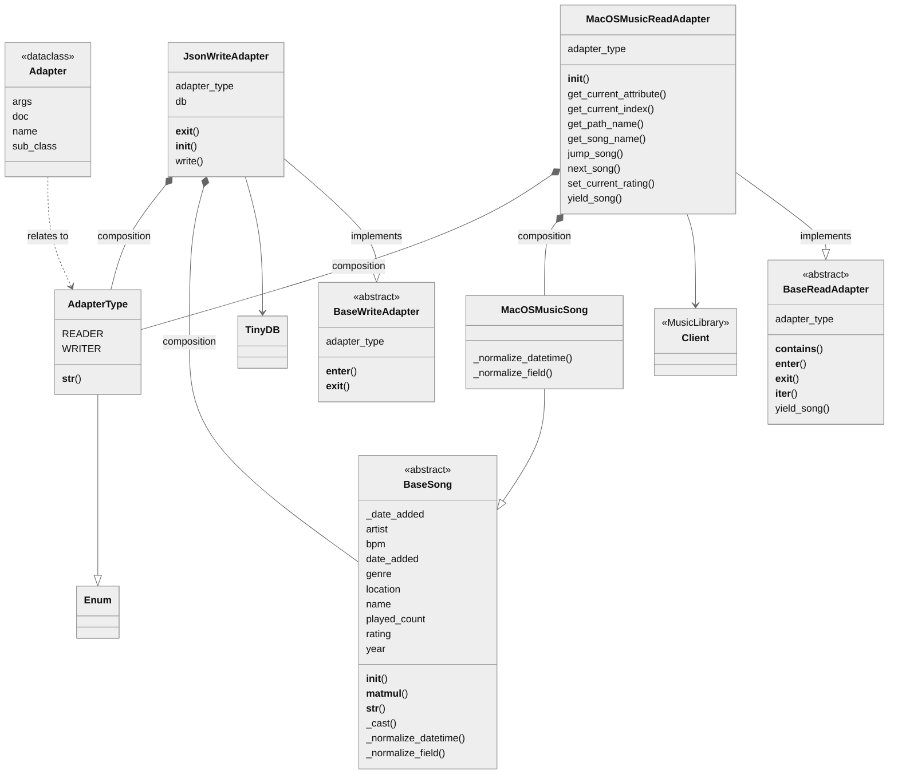

# Music Manager

Description goes here...


## Creating concrete Song class

```python
class CsvSong(BaseSong):
    @staticmethod
    def _normalize_field(foreign_field_name: Annotated[str, "Field name to be converted"]) -> Annotated[str, "Dataclass field name"]:
        """
        Required concrete method responsible for resolving field/attributes and inherits from BaseSong as dataclass.
        The below sample assures that field named "Path" will be read as "Location" when read.
        """
        t = {"Path": "Location"}
        return t.get(foreign_field_name, foreign_field_name)

    @staticmethod
    def _normalize_datetime(foreign_datetime: Annotated[str, "Datetime text to be converted"]) -> datetime.datetime:
        """
        Required concrete method responsible parsing the date_added into a valid datetime object.
        The below sample will use datetime.strptime to parse according to "format".
        """
        return datetime.datetime.strptime(foreign_datetime, "%Y-%m-%dT%H:%M:%SZ")

```

## Creating concrete Read class

```python
class CsvReadAdapter(BaseReadAdapter):
    """Read from CSV"""

    def __init__(self, csv_file: Annotated[str, "xml file from iTunes"]):
        """
        Type annotation will automatically generate CLI parameter type and description.
        """
        self.local_fields = ["Name", "Artist", "Path"]
        self.csv_file = csv_file

    def yield_song(self) -> Iterable[BaseSong]:
        """
        Required concrete method that "has a" (composition) and returns a BaseSong. 
        """
        s = self.tree[0].findall("dict")[0]
        if self.limit:
            s = s[:self.limit + 1]
        for item in s:
            try:
                if item[0].text == "Track ID":
                    keys = item[::2]
                    values = item[1::2]
            except (ValueError, IndexError):
                pass
            else:
                keys_values_el: list[tuple[Any, Any]] = list(zip(keys, values))
                key_values = {i[0].text: i[1].text for i in keys_values_el}
                yield TunesSong(**key_values)

```


## Class diagram

