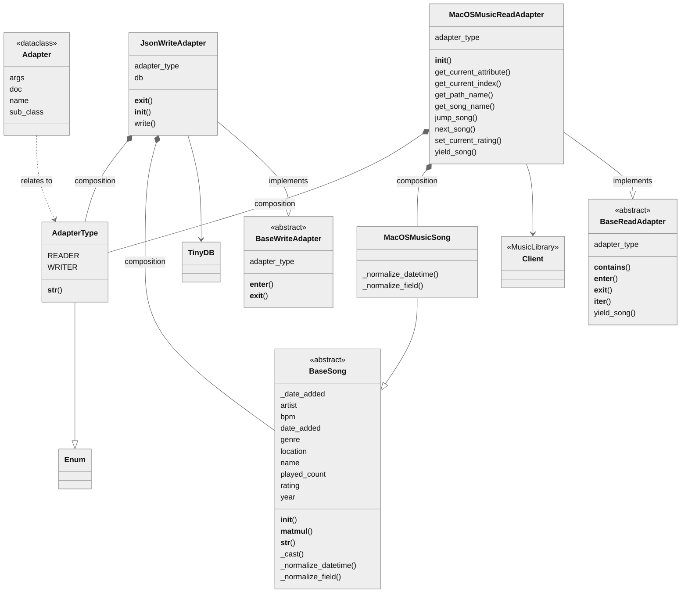

# Music Manager

Description goes here...

## Class diagram

```mermaid
%%{init: {'theme': 'neutral' } }%%
classDiagram

%% Classes related to serializing "songs"
class BaseSong {
  <<abstract>>
  _date_added
  artist
  bpm
  date_added
  genre
  location
  name
  played_count
  rating
  year
  __init__()
  __matmul__()
  __str__()
  _cast()
  _normalize_datetime()
  _normalize_field()
}

class MacOSMusicSong {

  _normalize_datetime()
  _normalize_field()
}


%% Classes related to "services" using songs
class BaseReadAdapter {
  <<abstract>>
  adapter_type
  __contains__()
  __enter__()
  __exit__()
  __iter__()
  yield_song()
}

class BaseWriteAdapter {
  <<abstract>> 
  adapter_type
  __enter__()
  __exit__()
}

class MacOSMusicReadAdapter {
  adapter_type
  __init__()
  get_current_attribute()
  get_current_index()
  get_path_name()
  get_song_name()
  jump_song()
  next_song()
  set_current_rating()
  yield_song()
}

class JsonWriteAdapter {
  adapter_type
  db
  __exit__()
  __init__()
  write()
}

%% Type of adapter used to construct arguments
class AdapterType{
  READER
  WRITER
  __str__()
}

class Adapter {
  <<dataclass>>
  args
  doc
  name
  sub_class

}

%% Dependent classes
class Enum 
class TinyDB
class Client {
<<MusicLibrary>>
 }


%% Relationships
AdapterType --|> Enum
Adapter ..> AdapterType : relates to

JsonWriteAdapter *-- AdapterType : composition
JsonWriteAdapter *-- BaseSong : composition
JsonWriteAdapter --> TinyDB 
JsonWriteAdapter --|> BaseWriteAdapter : implements

MacOSMusicSong --|> BaseSong
MacOSMusicReadAdapter *-- AdapterType : composition
MacOSMusicReadAdapter *-- MacOSMusicSong : composition
MacOSMusicReadAdapter --> Client
MacOSMusicReadAdapter --|> BaseReadAdapter : implements
```