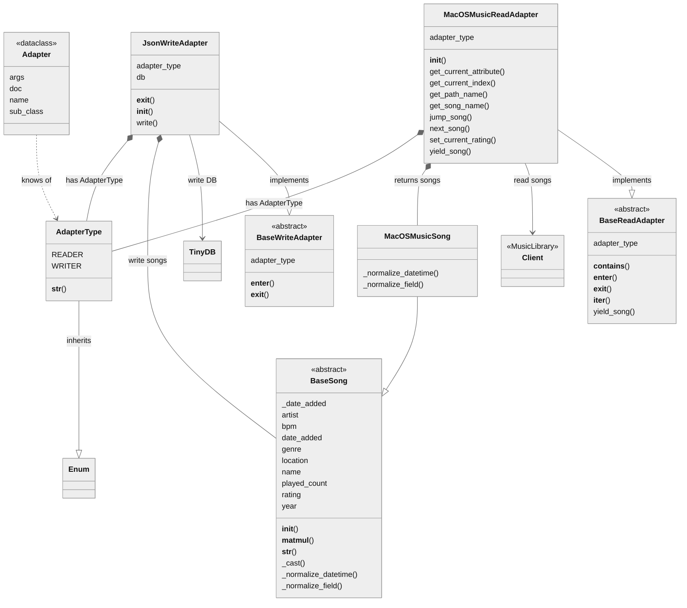

# Music Meta Manager


## Background

It started with a need for a framework allowing me transferring meta-data from Apple's iTunes *(such a ⭐️ rating)* that I had backup of into the more recent  MacOS Music application. I would also like to be able to export this meta-data into a more future-proof format as JSON in case of use with a different application.

The field names might differ between those applications and different packages exists to support <u>reading and writing interchangeably</u> between those so to allow this and at the same time making this <u>extensible</u> I found a good oportunity to write this as a <u>package</u> to fill this gap.

A good oportunity to challenge myself thinking more of the software design to follow principles such as [SOLID](https://en.wikipedia.org/wiki/SOLID) to make the code easier to read and maintain.


## Software design

Following a form of [bridge-pattern](https://en.wikipedia.org/wiki/Bridge_pattern) that allows us abstracting the application *(adapter)* class the field-definition *(song)*  to easier add support for additional application and song structures. Built into this package also support to be used as a <u>command-line tool</u> for easily transferring songs across applications or files.

Thanks to using *abstract base classes*, *type annotations* and *docstrings* allow <u>automatic generation of the parameters</u> thanks to some of the clever mechanics within Python.

Also adding some basic [operator overloading](https://en.wikipedia.org/wiki/Operator_overloading) for comparison and filtering purposes of songs.

This below is how I would visualise the software design and further down in this documentation you will also find a more complete class-diagaram.


### 

## Current built-in support for applications/formats

### Read
- TunesReadAdapter
- MacOSMusicReadAdapter

### Write
- JsonWriteAdapter


## Tutorial - User Guide

Below we'll take you through a sample where would add an additional CSV writer and reader for songs meta data e.g. to be transferred to MacOS Music application.

### Create a custom Song class

This is to be used together with your ReadAdapter or WriteAdapter by inherit BaseSong and implements the abstract methods with its main responsibility

- Normalize the fieldname in that application interchangable with BaseSong
- Convert string representation of datetime used for e.g. "created"

```python
class CsvSong(BaseSong):
    @staticmethod
    def normalize_field(foreign_field_name: Annotated[str, "Field name to be converted"]) -> Annotated[str, "Dataclass field name"]:
        """
        Required concrete method responsible for resolving field/attributes and inherits from BaseSong as dataclass.
        The below sample assures that field named "Path" will be read as "Location" when read.
        """
        t = {"Path": "Location"}
        return t.get(foreign_field_name, foreign_field_name)

    @staticmethod
    def normalize_datetime(foreign_datetime: Annotated[str, "Datetime text to be converted"]) -> datetime.datetime:
        """
        Required concrete method responsible parsing the date_added into a valid datetime object.
        The below sample will use datetime.strptime to parse according to "format".
        """
        return datetime.datetime.strptime(foreign_datetime, "%Y-%m-%dT%H:%M:%SZ")

```


### Create a custom WriteAdapter class

This gives a different example creating an adapter that allows writing to a CSV file. Main responsibility of those concrete methods are .. 

- initialize the writing of the data
- closing any resources exiting a context manager
- write operation using a instantiation of above song class

```python
class CsvWriteAdapter(BaseWriteAdapter):
    """Write to a CSV"""

    def __init__(self, write_csv: Annotated[str, "path to csv file"]) -> None:
        """
        Create a constructor for this adapter
        """
        self.csv_file = open(csv, 'w')

    def __exit__(self, exc_type, exc_val, exc_tb):
        """
        This is used for Context Manager assuring closing any resources
        """
        self.csv_file.close()

    def write(self, song: BaseSong):
        """
        Require abstract method to allow the WriteAdapter to function.
        Takes a BaseSong as argument and should write to the resource.
        """
        song_data = [song.name, song.artist, song.location]
        self.write(f"{'\t'.join(song_data)}\n")
```


### Create a custom ReadAdapter class

This is just to illustrate a sample reading from a CSV file. The docstring and annotation being used to generate help for CLI parameters and the main responsibility of the concrete methods are ..

- initalize the application for reading
- yield song used to allow the reader to act as an iterable

```python
class CsvReadAdapter(BaseReadAdapter):
    """Read from CSV"""

    def __init__(self, read_csv: Annotated[str, "path to csv file"]):
        """
        Type annotation will automatically generate CLI parameter type and description.
        """
        self.local_fields = ["Name", "Artist", "Path"]
        self.csv_file = csv_file

    def yield_song(self) -> Iterable[BaseSong]:
        """
        Required concrete method that "has a" (composition) and returns an Iterable of BaseSongs. 
        """
        with open(self.csv_file, 'r') as f:
            for line in csv.reader(f, delimiter='\t'):
                next_song = dict(zip(self.local_field, line))
                yield(CsvSong(**next_song))
```

### 

## Command line interface

The below below is to show how the parameters and help section would automatically get generated based on above sample.
To simplify not showing all the built in adapters.

```shell
$ mmm --help

usage: mmm [-h] [--MacOSMusicReadAdapter] [--CsvReadAdapter | --csv CSV] [--CsvWriteAdapter | --csv CSV]

Program for migration music meta data between different services

optional arguments:
  -h, --help               show this help message and exit
  --MacOSMusicReadAdapter  Read from MacOS Music application
  --CsvReadAdapter         Read from CSV
  --read_csv CSV           [CsvReadAdapter] path to csv file
  --CsvWriteAdapter        Write to a CSV
  --write_csv CSV          [CsvWriteAdapter] path to csv file
```


## Sample use cases

### Reading from iTunes and and write to JSON file

```python
with TunesReadAdapter(limit=3) as r, JsonWriteAdapter('my_music.json') as w:
  for song in r:
    print(f"Writing: {song}")
    w.write(song)
```

#### Resulting in

```
Writing: 10,000 Maniacs - Because The Night                        1998   ⭐️⭐️⭐️⭐️
Writing: Phil Fuldner - S-Express                                  1999   ⭐️⭐️
Writing: Hampenberg - Last Night                                   1999   ⭐️⭐️
```

### Usage of comparison operators on songs

```python
>>> print(song)
10,000 Maniacs - Because The Night                        1998   ⭐️⭐️⭐️⭐️

>>> song >= '⭐⭐'
True

>>> song < 1996
False

>>> other_song = song
>>> song @ other_song  # a special operator for comparing that name and album match
True
```

### Easily filtering with help of comparison

```python
>>> [song.name for song in TunesReadAdapter() if song >= '⭐⭐⭐' and song < 2022]
['Because The Night']
```


## Design documentation

### Class diagram

This below class diagram intentionally does not include all built-in classes to allow easier reading.

